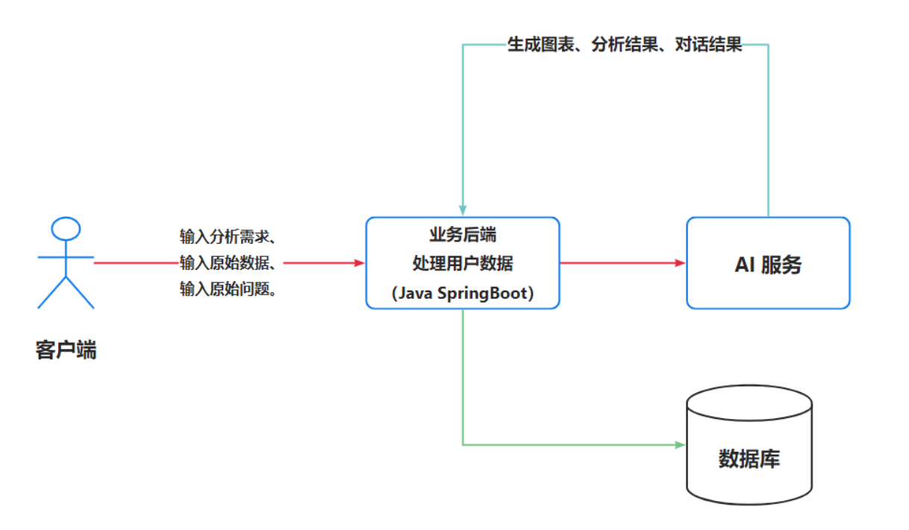
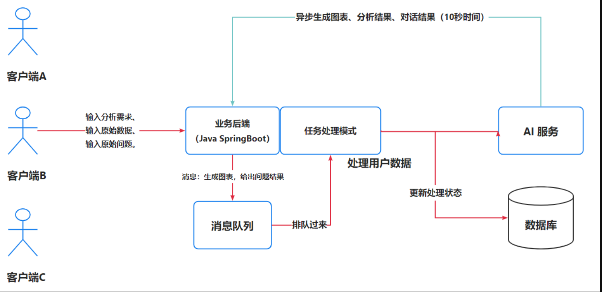
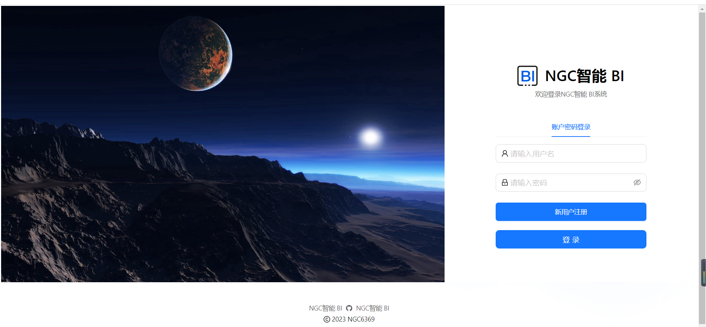
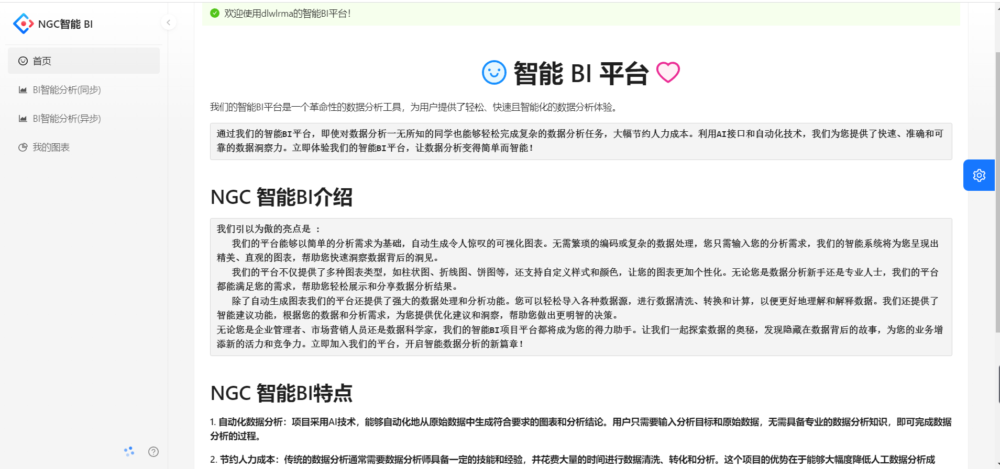
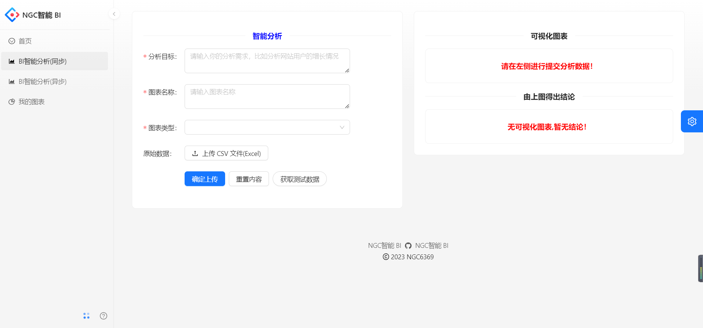
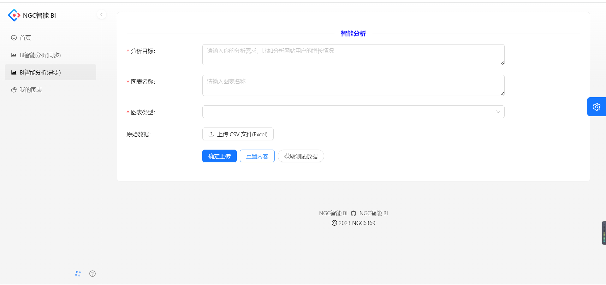
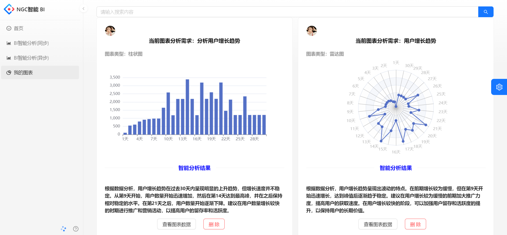

#  NGC 智能BI平台

## 项目介绍 📢
本项目是基于React+Spring Boot+RabbitMQ+AIGC的智能BI数据分析平台。

访问地址：http://121.40.102.29

> AIGC ：Artificial Intelligence Generation Content(AI 生成内容)

区别于传统的BI，数据分析者只需要导入最原始的数据集，输入想要进行分析的目标，就能利用AI自动生成一个符合要求的图表以及分析结论。此外，还会有图表管理、异步生成、AI对话等功能。只需输入分析目标、原始数据和原始问题，利用AI就能一键生成可视化图表、分析结论和问题解答，大幅降低人工数据分析成本。

## 项目功能 🎊
### 已有功能
1. 用户登录
2. 智能分析（同步）。调用AI根据用户上传csv文件生成对应的 JSON 数据，并使用 ECharts图表 将分析结果可视化展示
3. 智能分析（异步）。使用了线程池异步生成图表，最后将线程池改造成使用 RabbitMQ消息队列 保证消息的可靠性，实现消息重试机制
4. 用户限流。本项目使用到令牌桶限流算法，使用Redisson实现简单且高效分布式限流，限制用户每秒只能调用一次数据分析接口，防止用户恶意占用系统资源
5. 调用AI进行数据分析，并控制AI的输出
6. 由于AIGC的输入 Token 限制，使用 Easy Excel 解析用户上传的 XLSX 表格数据文件并压缩为CSV，实测提高了20%的单次输入数据量、并节约了成本。
7. 后端自定义 Prompt 预设模板并封装用户输入的数据和分析诉求，通过对接 AIGC 接口生成可视化图表 JSON 配置和分析结论，返回给前端渲染。
### 新增功能
1. 新增用户注册功能
2. 新增用户调用次数表，用户注册同时完成插入次数表，当使用AI生成接口时分布式锁对使用次数锁定，次数扣减才释放锁
3. 新增删除图表/对话结果功能
4. 新增死信队列，将处理图表的队列绑定到死信队列上，保证消息可靠性，若分析失败，则进入死信，将补偿用户次数
7. 修改前端登录/注册界面
8. 优化前端显示，效果如下展示
9. 用户查看原始数据

## 项目背景 📖
1.基于AI快速发展的时代，AI + 程序员 = 无限可能。
2. 传统数据分析流程繁琐：传统的数据分析过程需要经历繁琐的数据处理和可视化操作，耗时且复杂。
3. 技术要求高：传统数据分析需要数据分析者具备一定的技术和专业知识，限制了非专业人士的参与。
4. 人工成本高：传统数据分析需要大量的人力投入，成本昂贵。
5. AI自动生成图表和分析结论：该项目利用AI技术，只需导入原始数据和输入分析目标，即可自动生成符合要求的图表和分析结论。
6. 提高效率降低成本：通过项目的应用，能够大幅降低人工数据分析成本，提高数据分析的效率和准确性。

## 项目核心亮点 ⭐
1. 自动化分析：通过AI技术，将传统繁琐的数据处理和可视化操作自动化，使得数据分析过程更加高效、快速和准确。
2. 一键生成：只需要导入原始数据集和输入分析目标，系统即可自动生成符合要求的可视化图表和分析结论，无需手动进行复杂的操作和计算。
3. 可视化管理：项目提供了图表管理功能，可以对生成的图表进行整理、保存和分享，方便用户进行后续的分析和展示。
4. 异步生成：项目支持异步生成，即使处理大规模数据集也能保持较低的响应时间，提高用户的使用体验和效率。
5. 智能数据处理：项目通过AI技术实现了智能化的数据处理功能，能够自动识别和处理各种数据类型、格式和缺失值，提高数据的准确性和一致性。

## 快速启动 🏃‍♂️
1. 下载/拉取本项目到本地
2. 通过 IDEA 代码编辑器进行打开项目，等待依赖的下载
3. 修改配置文件 `application.yaml` 的信息，比如数据库、Redis、RabbitMQ等
4. 修改信息完成后，通过 `MainApplication` 程序进行运行项目

### 环境配置（建议）🚞
1. Java Version：1.8.0_371
2. MySQL：8.0.20
3. Redis：5.0.14
4. Erlang：24.2
5. RabbitMQ：3.9.11
6. RabbitMQ延迟队列插件：3.10.0.ez ( 选择一个与RabbitMQ版本兼容的即可)

## 项目架构图 🔥
### 基础架构
基础架构：客户端输入分析诉求和原始数据，向业务后端发送请求。业务后端利用AI服务处理客户端数据，保持到数据库，并生成图表。处理后的数据由业务后端发送给AI服务，AI服务生成结果并返回给后端，最终将结果返回给客户端展示。

### 优化项目架构-异步化处理
优化流程（异步化）：客户端输入分析诉求和原始数据，向业务后端发送请求。业务后端将请求事件放入消息队列，并为客户端生成取餐号，让要生成图表的客户端去排队，消息队列根据I服务负载情况，定期检查进度，如果AI服务还能处理更多的图表生成请求，就向任务处理模块发送消息。

任务处理模块调用AI服务处理客户端数据，AI 服务异步生成结果返回给后端并保存到数据库，当后端的AI工服务生成完毕后，可以通过向前端发送通知的方式，或者通过业务后端监控数据库中图表生成服务的状态，来确定生成结果是否可用。若生成结果可用，前端即可获取并处理相应的数据，最终将结果返回给客户端展示。在此期间，用户可以去做自己的事情。

## 项目技术栈和特点 ❤️‍🔥
### 后端
1. Spring Boot 2.7.2
2. Spring MVC
3. MyBatis + MyBatis Plus 数据访问（开启分页）
4. Spring Boot 调试工具和项目处理器
5. Spring AOP 切面编程
6. Spring Scheduler 定时任务
7. Spring 事务注解
8. Redis：Redisson限流控制
9. MyBatis-Plus 数据库访问结构
10. IDEA插件 MyBatisX ： 根据数据库表自动生成
11. **RabbitMQ：消息队列**
12. AI SDK：鱼聪明AI接口开发
13. JDK 线程池及异步化
15. Swagger + Knife4j 项目文档
16. Easy Excel：表格数据处理、Hutool工具库 、Apache Common Utils、Gson 解析库、Lombok 注解

### 前端
1. React 18
2. Umi 4 前端框架
3. Ant Design Pro 5.x 脚手架
4. Ant Design 组件库 
5. OpenAPI 代码生成：自动生成后端调用代码（来自鱼聪明开发平台）
6. EChart 图表生成

### 数据存储
- MySQL 数据库

### 项目特性
- Spring Session Redis 分布式登录
- 全局请求响应拦截器（记录日志）
- 全局异常处理器
- 自定义错误码
- 封装通用响应类
- Swagger + Knife4j 接口文档
- 自定义权限注解 + 全局校验
- 全局跨域处理
- 长整数丢失精度解决
- 多环境配置

### 项目功能
- 用户登录、注册、注销、更新、检索、权限管理
- 图表创建、删除、查询、查看愿数据
- AI对话创建、删除、查询
### 单元测试
- JUnit5 单元测试、业务功能单元测试

## BI项目展示

